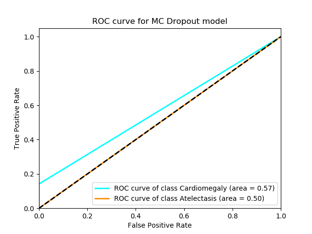

# Code, performance data and write-up for Monte Carlo Dropout (Bayesian Deep Learning)

Brief description: Enabling dropout during test time makes a neural network's predictions stochastic. We get multiple outputs from the sample datapoint and if there is a lot of variation in the outputs, the model is uncertain about its predictions. In this case, we use prior probability of disease in training dataset.

We could not complete this section of the project. We only have performance data for two diseases (Atelectasis, Cardiomegaly) and that data is shown below.

Our MC dropout convnet model has the following architecture:
```
SpatialConcreteDropout(Conv2D(32, kernel_size=(3, 3))) -> SpatialConcreteDropout(Conv2D(64, (3, 3)) -> MaxPooling2D -> Flatten -> ConcreteDropout(Dense(128) -> ConcreteDropout(Dense(1))
```



## Running instructions
```
bash train_single_disease_model.sh
```
Please modify the dataset folders if your data isn't in `data/chexpert/`

The trained model wasn't attached because each on had 400 million parameters (most probably poor implementation of SpatialConcreteDropout). The smallest model size is 1.4GB. The models are located at `/home/gsrinivas6/saved_models/DISEASE_NAME.h5`.
